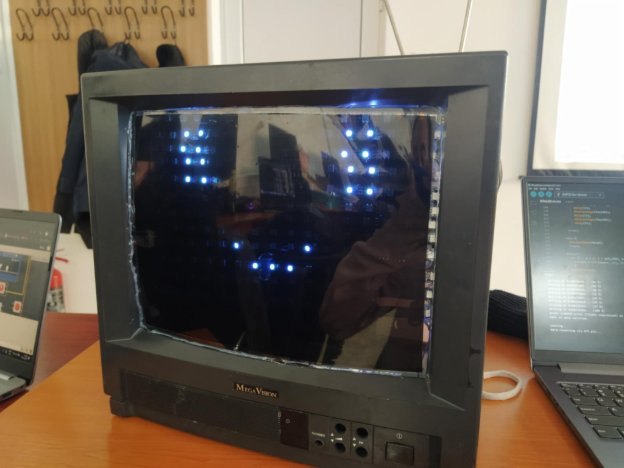

You can see a demonstration of it working here:
https://www.youtube.com/shorts/n9w06f9NMtE

TVhead

Materials needed:

- CRT TV;
- ESP32 or any microcontroller with Bluetooth compatibility;
- ~ 5 m long LED strip. I picked **WS2812B** as they can run on 5V. 60 LEDs/m density should be more than enough;
- External battery used for charging phones. It needs to send 5V and and we need 2 out ports: one for the ESP and one for the LEDs;
- Plexiglas or any transparent polycarbonate;
- Dark window tint;
- 2 USB cables;
- A construction  helmet;
- A pool noodle;
- Hot glue;
- Soldering iron and solder;
- Wires as connectors.

The project started with an old, 14’’ CRT TV that has been broken for a while and had no use. It used to be common to find these near trash bins, but by now, most have been thrown away, so I suggest looking for one at your local recycling center. When removing the core components, be careful, as they can and will implode. They can also store electricity for a long while, so you should handle it with care and maybe discharge it. 

After I got just the shell from the TV, I needed a hole for my head, so I used a drill and some discs to shave off plastic. You should do it in a ventilated area and with a mask, as the friction literally melts the plastic and releases some fumes.

Measure the opening for the screen and cut a slightly bigger piece of plexiglas to have some margin of error. Spray it with some alcohol and wipe it clean before adding the window tint to it. This is necessary for the overall look of the TV and to also hide your face behind it.

` `

I then cut the LED strip in 13 little strips, 17 LEDs long, to form a matrix and used hot glue to attach it to the back of the screen. There is some space left in between the strips for a way to see out. Otherwise, you would need to make a periscope. You could try and use led strip connectors for the 180˚ turn they make, but I only got unreliable connections with them. Instead, I had to solder the strips to fit to my angles.

World`s worst solder

I needed a way to attach the battery to the case in a way that would allow me to remove it in order to charge it. To solve this, I quickly designed a holder for it and I 3d printed it, but this step is very much optional.

` `The battery is placed in the back of the tv, to offset the weight of the screen, as it can put some strain on the neck.

A quick diagram of the wiring:

The red wire from the battery goes to the +5 pin on the led srips. The black is a common ground, connecting the ground from the LED strip to the GND pin on the ESP and the ground on the power bank. The blue cable is a common micro usb cable used to power on the ESP. The green wire is a data wire, to send information to the addressable LEDs.

To control the mask, you need a device with Bluetooth functionality. It sends serial data to the ESP that in turn interprets it as a command to change the animation on screen.

I mounted everything together in this order: 

- First the screen
- Then electrical internals, with the LEDS glued to the screen. Retrospectively, it would be much cleaner and simpler to just tape them to the screen.
- Now the fun part: place the helmet in, close the mask parts together, then glue it to the mask with the pool noodles.

Now you can use the rest of the pool noodle to create a soft layer around the neck area, where you could get pinched by the sharp plastic.

And there you have it:

